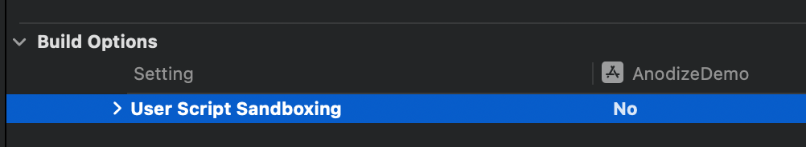
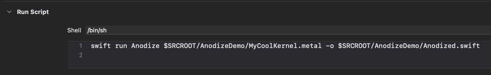
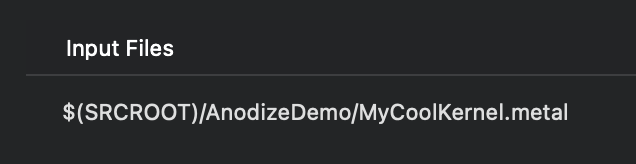
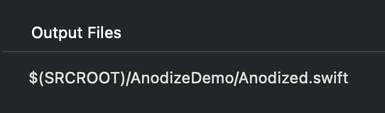

# Anodize

Type safety for Metal. 🤘

Used in [Sculptura](https://sculptura.app/)

Suppose we've got the following MSL kernel:

```Metal
kernel void MyCoolKernel(device float* buffer,
                         constant float& value,
                         uint tid [[thread_position_in_grid]]) {
    buffer[tid] += value;
}
```

Running `swift run Anodize MyCoolKernel.metal -o Anodized.swift` generates the file `Anodized.swift` which contains wrappers for our kernel(s).

And then call the kernel from Swift with type safety, without worrying about binding indices. 😎

```Swift

let device = MTLCreateSystemDefaultDevice()!
let kernel = MyCoolKernel(device: device)

let array = try MutableGPUArray<Float>(data: [1,2,3])

let queue = device.makeCommandQueue()!
let buf = queue.makeCommandBuffer()!

try kernel
    .begin(buf)
    .buffer(array)
    .value(bytes: 1)
    .dispatch(threads: 3, threadsPerThreadgroup: 1)
    .end()

buf.commit()
buf.waitUntilCompleted()

print("array: \(array.array)") // prints [2.0, 3.0, 4.0]
        
```

### Xcode Integration

You can run Anodize on every build when you change your metal files. It's actually pretty quick, because it doesn't have to run the compiler backend and it compiles in parallel. Sculptura has about 60 kernels and it takes about 2.5s on my Mac Mini M2.

First, unforunately, you need to disable script sandboxing because Anodize uses Metal:



Then create a Run Script build phase. Be sure to move it before the Compile Sources build phase:



Set the `Input Files` to your metal files you are compiling, and output file to the generated file:





See the [demo project](./Demo/AnodizeDemo/) for an example.

### Notes

- Type safety is limited by Metal's reflection API. For user-defined types, we can only check the size is what is expected (this seems reasonably good).
- You can adopt Anodize gradually in your codebase (as I'm doing in Sculptura).
- You don't have to use `GPUArray`, you can make another class that conforms to `GPUBufferProvider`.
- You can pass a raw `MTLBuffer` but you'll lose type safety (at least the binding indices will be correct).
- Vertex and fragment functions aren't yet supported.
